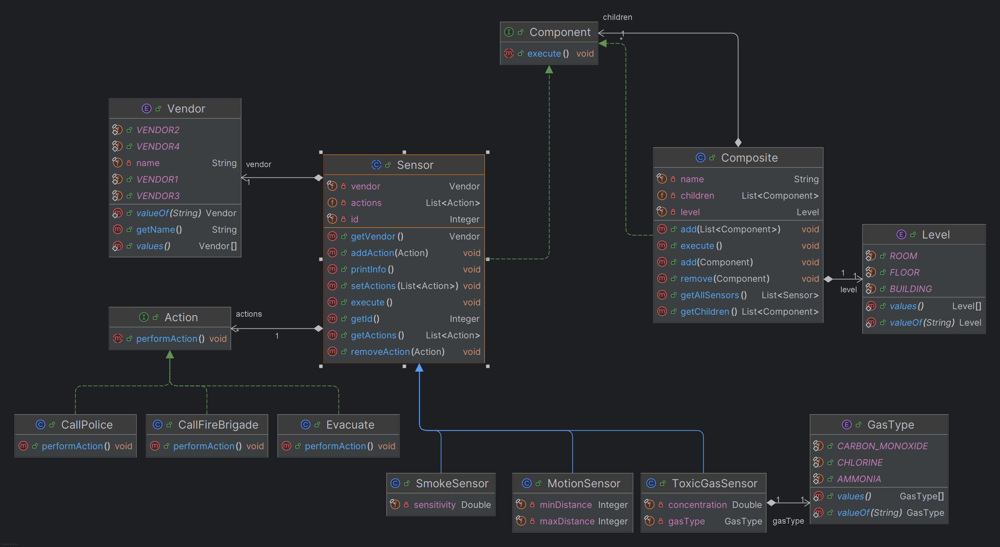

# Emergency Center Management System

## Overview

This project implements a modular and extensible emergency center management system designed to manage various sensor types (e.g., smoke, motion, toxic gas) within a building. The system allows for centralized control, testing, and configuration, with an emphasis on scalability and maintainability.

## Design Patterns Possible

- **Factory Pattern:** Enables the creation of different types of sensors dynamically, allowing for easy addition of new sensor types without altering existing code.
- **Strategy Pattern:** Handles different behaviors for sensors, such as triggering various emergency responses (e.g., alerting emergency services, initiating evacuation).
- **Composite Pattern:** Manages sensors at various levels of granularity, supporting grouping by building, level, or room.
- **Observer Pattern:** Facilitates notification of relevant components when a sensor is activated, promoting a decoupled system architecture.

## Key Features

- **Modular Design:** The use of design patterns ensures the system is modular, maintainable, and adaptable to various requirements.
- **Simulation Mode:** The system includes functionality to simulate the operations of the emergency center for testing purposes.
- **Scalable Grouping:** The Composite pattern allows flexible sensor management at different levels, from individual sensors to entire buildings.

## UML Diagram With Strategy and Composite Pattern Used

